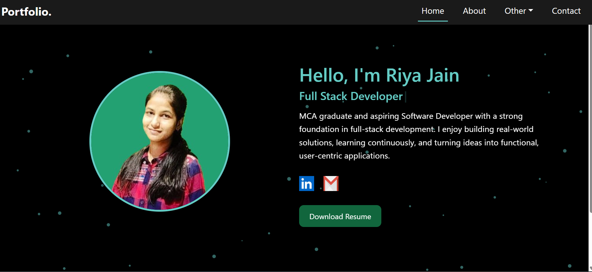
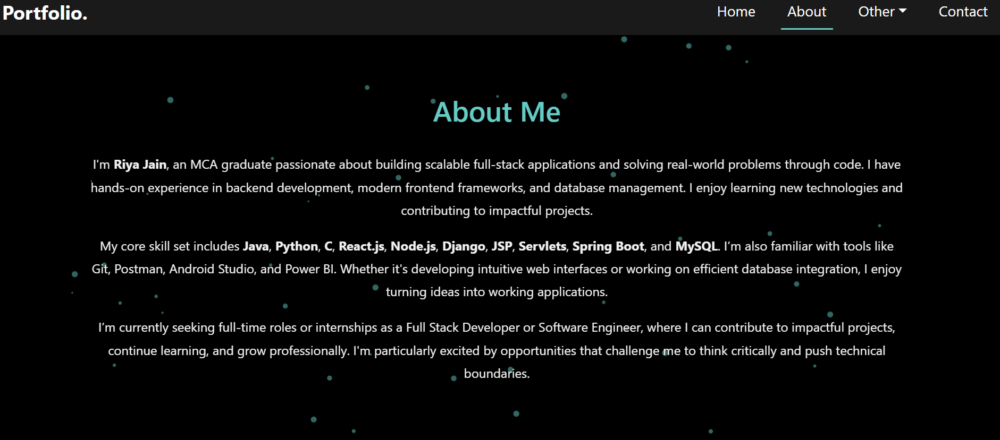
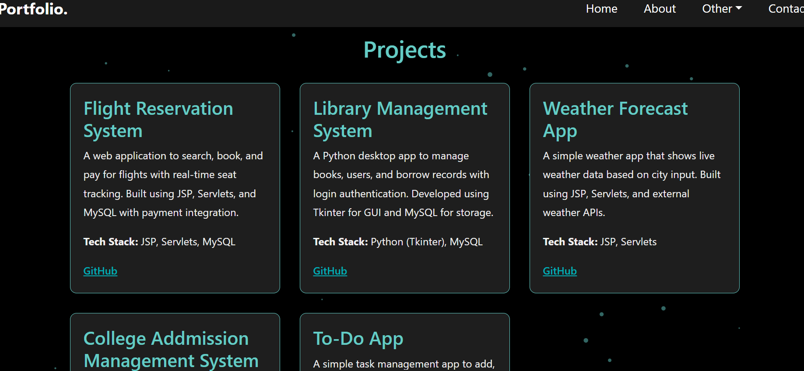
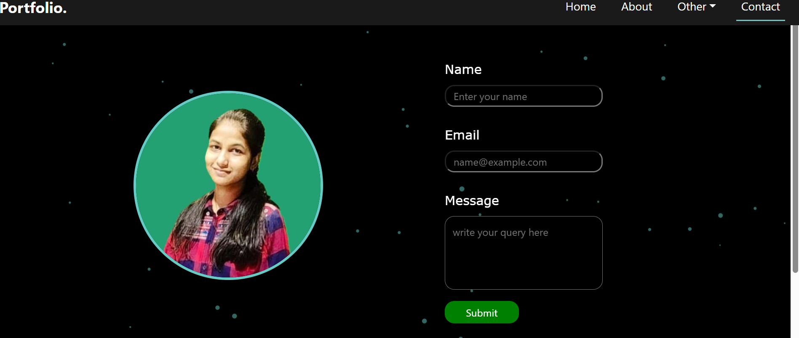

# 💼 Personal Portfolio Website

A responsive and professional portfolio website built to showcase my projects, skills, and certifications. The portfolio also features a contact form connected to a backend server using MongoDB to handle queries.

---

## 📌 Features

- Responsive design for mobile and desktop
- Animated particle background
- Projects and certificates displayed in interactive cards
- Contact form with server integration (Node.js + MongoDB)
- Footer with copyright

---

## 🛠️ Tech Stack

### Frontend:
- React.js
- React Router
- Bootstrap
- HTML5 & CSS3
- react-tsparticles
- react-simple-typewriter

### Backend:
- Node.js
- Express.js
- MongoDB (with Mongoose)
- Axios

---

## 📂 Folder Structure

```
Portfolio/
├── Client/
│   ├── public/
│   ├── src/
│   │   ├── Components/
│   │   ├── App.js
│   │   └── ...
│   └── package.json
├── Server/
│   ├── models/
│   ├── routes/
│   ├── Contactdb.js
│   └── ...
```

---

## 📧 Contact Form Setup (Backend)

- **POST API**: `/Contact`
- Stores name, email, and message to MongoDB
- Responds with success or error message

---

## 💡 How to Use

1. Clone the repo:
   ```bash
   git clone https://github.com/Riya-Jain-here/your-repo-name.git
   ```
2. Install dependencies for client:
   ```bash
   cd Client
   npm install
   ```
3. Run the React frontend:
   ```bash
   npm start
   ```
4. Set up the backend (`cd Server`), create `.env`, and run:
   ```bash
   npm install
   node Contactdb.js
   ```
---

## ✨ Screenshots

### 🏠 Home Page


### 👤 About Page


### 💼 Projects Page


### 🧾 Certificates Page


### 📞 Contact Page


---

## 📃 License

This project is licensed under the MIT License.

---

## 🙋‍♀️ About Me

I'm Riya Jain, an MCA graduate passionate about building user-focused, visually appealing, and functional web applications.  
Let's connect!
